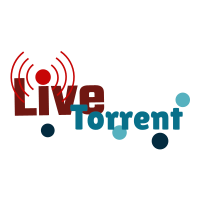

# LiveTorrentBackend

<!--[](https://travis-ci.org/Davenchy/live-torrent-backend)-->
[](https://twitter.com/fadi_davenchy?ref_src=twsrc%5Etfw)

Back end server for [Live Torrent](https://github.com/Davenchy/live-torrent).



[](https://gitpod.io/#https://github.com/Davenchy/live-torrent-backend)

## Docker

- Docker Image: `davenchy/live-torrent-backend:latest`

```sh
docker run -d -p 3000:3000 -v $(pwd)/downloads:/app/downloads davenchy/live-torrent-backend:latest
```

- Set a volume to `/app/downloads` so you could control the downloaded files.

## Install

```bash
git clone --depth=1 https://github.com/Davenchy/live-torrent-backend.git

cd live-torrent-backend

npm install

npm start
```

- for more information about the OpenSubtitles user agent from [here](https://trac.opensubtitles.org/projects/opensubtitles/wiki/DevReadFirst).
